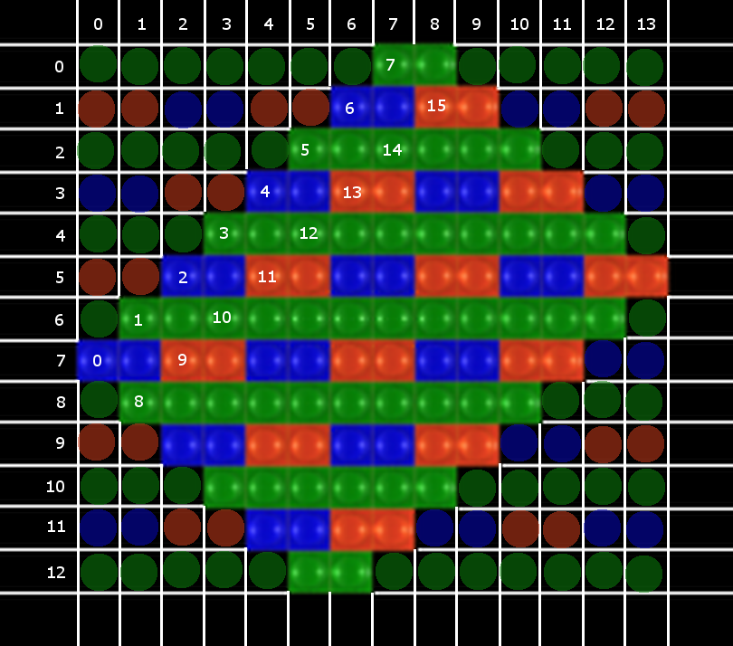

Fuji EXR filter layout:




## ABOUT

This collection represents attempts at decoding Fuji EXR data. None of the
methods attempted here is entirely successful in matching the quality of Fuji's
in-camera decoder, although under some circumstances, the results are actually
better in some ways.

One obvious set of advantages is gained just by decoding to uncomressed high
bit-depth media:

  * No JPEG sharpening
  * No compression-related blockiness
  * Better tonal correction and white balance
  * Higer effective dynamic range

The yet unmatched performance factors of the proprietary Fuji decoder are:

  * Noise suppression
  * Lens correction

Noise appears to be the most serious issue. The EXR sensor sites are very small
and noisy (chroma noise is particularly strong). No commonly-known noise
suppression method can cope with such amount of nose effectively. Fuji has
obviously done a good job but the algorithm is not known.

Lens correction is another feature that Fuji has done well. Their in-camera
JPEGs show no trace of chromatic aberration. Unlike noise reduction, lens
correction is a better-understood process, but for the time being, this camera's
lens parameters are not known. None of the tools presented here can fix
distortions or chromatic aberration.

## TOOLS


## USAGE

```
dcraw -v -w -d -s all -6 -T -b 0.7 raw.RAF
./fuji-exr-ssd raw_[01].tiff out.tiff
```

* `raw.RAF`: Fuji raw image, shot in EXR high-res mode, or in P-mode
* `raw_[01].tiff`:  camera sensor data in 16-bit grayscale (Bayer), two frames
* `out.tiff`:  demosaicked RGB output, rotated 45 degrees

Presently supported camera orientations: landscape (horizontal), portrait (270CCW). Other orientations need more work (interleaving rules are different for each).


## REFERENCES / FOOD FOR THOUGHT

date | authors | title
---|---|---
2015-07-07 | Joan Duran, Antoni Buades | [A Demosaicking Algorithm with Adaptive Inter-channel Correlation](http://www.ipol.im/pub/art/2015/145)
2014 | Alan Gibson | [Demosaicing with ImageMagic](http://im.snibgo.com/demosaic.htm)
2012-08-01 | Eric Dubois and Gwanggil Jeon | [Demosaicking of Noisy Bayer-Sampled Color Images with Least-Squares Luma-Chroma Demultiplexing and Noise Level Estimation: Additional Results](http://www.site.uottawa.ca/~edubois/lslcd_ne/)
2011-06-01 | Antoni Buades, Bartomeu Coll, Jean-Michel Morel, and Catalina Sbert | [Self-similarity Driven Demosaicking, Image Processing On Line, 1 (2011)](http://dx.doi.org/10.5201/ipol.2011.bcms-ssdd)
2010 | Brian Leung, Gwanggil Jeon, and Eric Dubois | [Least-Squares Luma-Chroma Demultiplexing Algorithm for Bayer Demosaicking](http://www.site.uottawa.ca/~edubois/lslcd/article/TIP-06195-2010.R1_2col.pdf)
 | Craig Stark | [Debayering Demystified](http://www.stark-labs.com/craig/resources/Articles-&-Reviews/Debayering_API.pdf)
 | Henrique S. Malvar, Li-wei He, and Ross Cutler | [High-Quality Linear Interpolation for Demosaicing of Bayer-Patterned Color Images](http://research.microsoft.com/pubs/102068/Demosaicing_ICASSP04.pdf)
 | Sander Pool, Zbynek Vrastil | [PixInsight Reference Documentation: Debayer](http://pixinsight.com/doc/tools/Debayer/Debayer.html)
2010-01 | Robert A. Maschal Jr., S. Susan Young, Joe Reynolds, Keith Krapels, Jonathan Fanning, and Ted Corbin | [Review of Bayer Pattern Color Filter Array (CFA) Demosaicing with New Quality Assessment Algorithms](http://www.arl.army.mil/arlreports/2010/ARL-TR-5061.pdf)
2007 | Sira Ferradans, Marcelo Bertalm ́ıo and Vicent Caselles | [Geometry based Demosaicking](http://www.gpi.upf.edu/static/sira/Sira_Ferradans/Demosaicking_files/GeometrybasedDemosaicking.pdf)
2007-09-05 | Antoni Buades, Bartomeu Coll, Jean-Michel Morel, Catalina Sbert | [Non local demosaicing](http://dmi.uib.es/~tami/publicacions/CMLA2007-15.pdf)
2004 | Eric P. Bennett, Matthew Uyttendaele, C. Lawrence Zitnick, Richard Szeliski, and Sing Bing Kang | [Video and Image Bayesian Demosaicing with a Two Color Image Prior](http://research.microsoft.com/en-us/um/people/larryz/bennett-eccv06.pdf)
